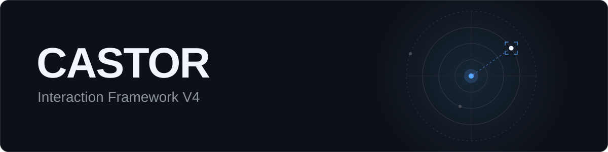

<div align="center">




</div>

Framework científico para extrair métricas objetivas de engajamento físico e visual entre crianças (com foco no Transtorno do Espectro Autista, TEA) e o robô social **CASTOR**. Desenvolvido para apoiar pesquisas em Interação Humano-Robô Cognitiva (IHRc), analisa vídeos de sessões terapêuticas com modelos de IA de estado da arte e reduz a subjetividade da observação manual.

## Funcionalidades

| Módulo | Descrição |
| :-- | :-- |
| **Rastreamento multi-alvo** | Acompanha vários participantes na cena e recupera IDs automaticamente via IoU após oclusões. |
| **Atenção visual** | Gera mapas de calor de olhar com o Gazelle (DINOv2) e estima se a criança direciona a atenção ao CASTOR. |
| **Proxêmica** | Converte pixels em centímetros por homografia (Bird's-Eye View) e classifica a interação nas zonas íntima, pessoal, social e pública. |
| **Interação física** | Extrai pontos-chave de corpo e mãos com o MediaPipe para detectar contatos e intenções de toque (alcance). |
| **Score multimodal de engajamento** | Índice global de 0 a 100 que combina componentes visuais, proxêmicos, táteis e temporais. |
| **Relatórios** | Relatório clínico em PDF, dashboards visuais e dados brutos em CSV e JSON para análise estatística. |

## Arquitetura

Construído sobre **Clean Architecture** e **SOLID**, com foco em escalabilidade e testabilidade para pesquisas de longo prazo. O núcleo não depende de bibliotecas de IA.

```text
src/
├── core/         regras de negócio, métricas e entidades matemáticas puras
├── adapters/     YOLOv8, MediaPipe, Gazelle, FPDF, Matplotlib
└── use_cases/    analyze_session.py: orquestra os frames (OpenCV) e a extração de dados
```

## Requisitos

| Componente | Especificação |
| :-- | :-- |
| CPU | Intel Core i5/i7 (8ª geração ou superior) ou AMD equivalente |
| RAM | 16 GB (mínimo), 32 GB (recomendado) |
| GPU | NVIDIA com CUDA e no mínimo 6 GB de VRAM (recomendada para processamento mais rápido) |

## Instalação

```bash
git clone https://github.com/SEU_USUARIO/castor-interaction-framework.git
cd castor-interaction-framework

python -m venv .venv
source .venv/bin/activate    # Windows: .venv\Scripts\activate
pip install -r requirements.txt
```

## Licença

Distribuído sob a licença MIT.
